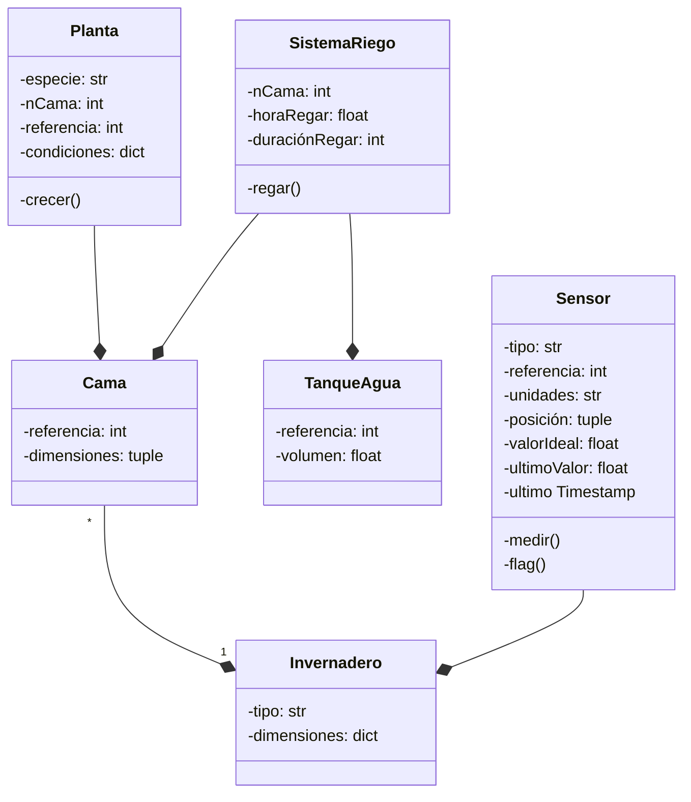

# Reto-POO-No.2
### Invernadero

```mermaid
classDiagram
direction TB
    class Sensor {
	    -tipo: str
	    -referencia: int
	    -unidades: str
	    -posición: tuple
	    -valorIdeal: float
	    -ultimoValor: float
	    -ultimo Timestamp
	    -medir()
	    -flag()
    }

    class TanqueAgua {
	    -referencia: int
	    -volumen: float
    }

    class Cama {
	    -referencia: int
	    -dimensiones: tuple
    }

    class SistemaRiego {
	    -nCama: int
	    -horaRegar: float
	    -duraciónRegar: int
	    -regar()
    }

    class Planta {
	    -especie: str
	    -nCama: int
	    -referencia: int
	    -condiciones: dict
	    -crecer()
    }

    class Invernadero {
	    -tipo: str
	    -dimensiones: dict
    }

    Planta --* Cama
    Cama "*" --* "1" Invernadero
    Sensor --* Invernadero
    SistemaRiego --* Cama
    SistemaRiego --* TanqueAgua
```
